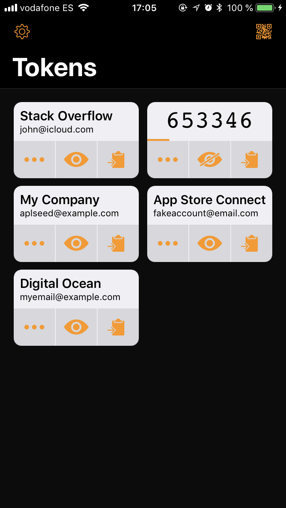
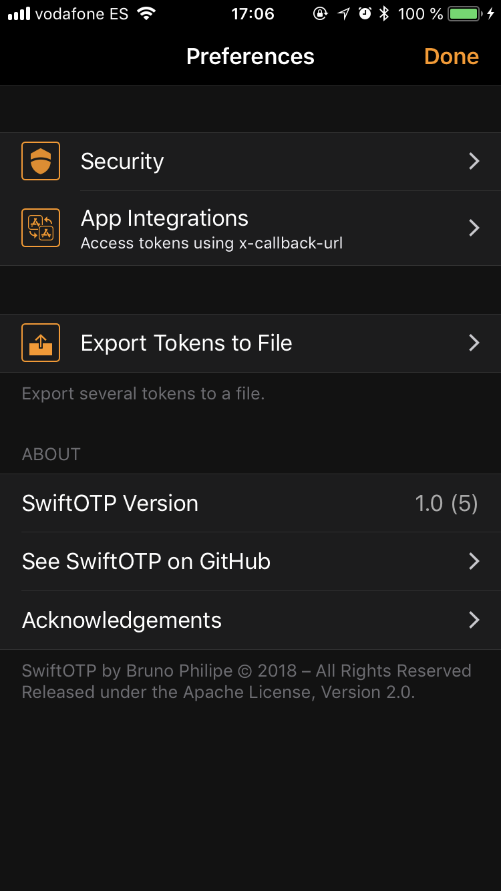
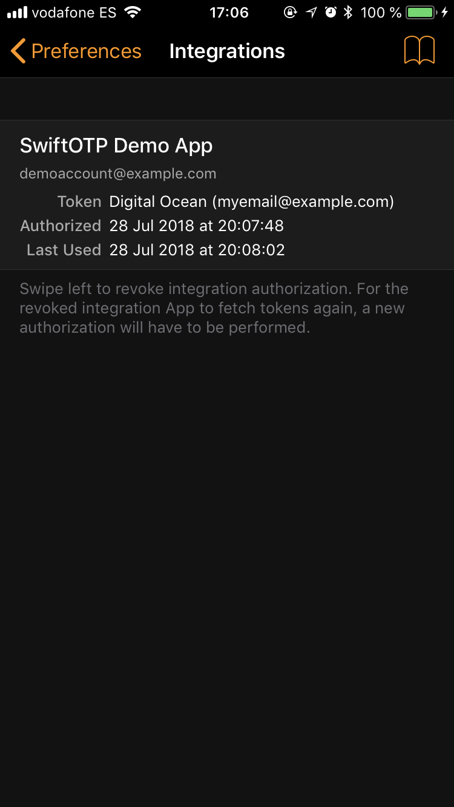
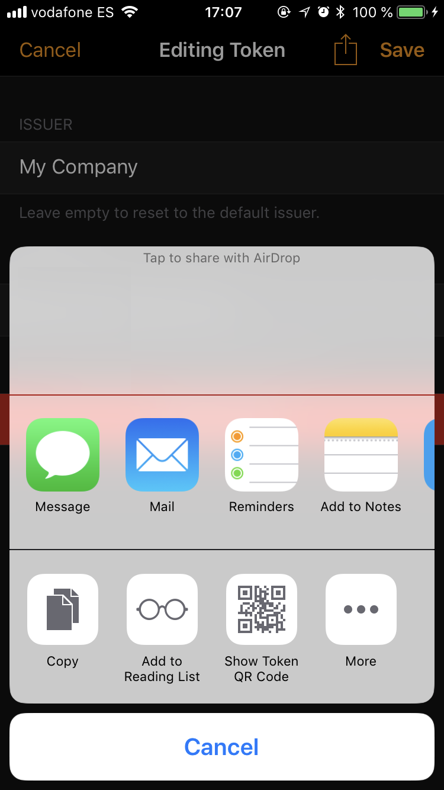

# SwiftOTP

OTP App with Siri Integration, and support for Shortcuts.

<a href="Screenshots/ScreenShot1.png"></a>
<a href="Screenshots/ScreenShot2.png"></a>
<a href="Screenshots/ScreenShot3.png"></a>
<a href="Screenshots/ScreenShot4.png"></a>

**⚠️ Note:** This app is still a work in progress. It might never make it into production level! There might be bugs and security issues not yet found. There might be data loss issues. **Therefore I strongly advise against using this App for your own personal OTP codes.** Instead, you should use test (fake) OTP tokens, which you can generate from sites like [www.xanxys.net/totp](http://www.xanxys.net/totp/) and [authenticator.ppl.family](https://authenticator.ppl.family).

## About

SwiftOTP is a modern second-factor authentication (TOTP and HOTP) application for iOS written in Swift.

This app is partly based on [RedHat's FreeOTP](https://github.com/freeotp/freeotp-ios), from which the OTP model classes were used. However, everything else is original work.

## Motivation

Although FreeOTP is a good App, it is still not updated for the latest iPhones, and it lacks support for the latest and coolest iOS features, such as Siri and Shortcuts integration.

This means that you can setup Siri to reply to a prompt such as "Hey Siri, OTP code for Google" with "The OTP code for Google is 123456". You can also integrate it into Shortcuts to fetch the token, for whatever use case you might have.

Note:

This project used to support x-callback-url integration, however since the Shortcuts app now supports data transfer between shortcuts, this api was deemed redundant. Please use shortcuts to integrate SwiftOTP with other apps. 

## How to Use

### Siri Intent

Every time you tap the "eye" icon on a token cell to show its code, SwiftOTP donates a Siri intent to the system. After that is done, you can go to the Settings App and navigate to "Siri & Search > More Shortcuts". There all the recent donations that all Apps made to iOS, including the SwiftOTP ones (one intent for each OTP token donated). Tap any donation to record a voice prompt that you can use to get Siri to run that intent for you. After the intent runs (in the background), Siri will show you and say the OTP code out loud.

### Shortcuts

Shortcuts can't pass data between apps. Therefore SwiftOTP can place the OTP code for the intent on the pasteboard for 3 seconds. This is disabled by default. To enable it, from inside SwiftOTP, navigate to "Preferences > Security" and enable the toggle next to "Also Place in Clipboard".

## Security Considerations

### Why integrate with Siri? They'll say your codes out loud!

That is not the case if the device is set to silent mode, or if you have earphones connected. Considering many people use earphones to listen to music or make calls during the day while sitting at their desk anyway, integrating Siri so they can say the codes without having to manually operate the phone can be a great productivity tool.

### Why did you do X??? Security!

Once again, this app is a work in progress, and pretty much a proof-of-concept. I'm not telling anyone to replace their current OTP apps with SwiftOTP (actually, I do the exact opposite of that in the beginning of this readme). I imagined what it would be like to create these integrations and decided to build them.

## License

SwiftOTP is licensed under the Apache License Version 2.0. See LICENSE.

```
Copyright 2018 Bruno Philipe

Licensed under the Apache License, Version 2.0 (the "License");
you may not use this file except in compliance with the License.
You may obtain a copy of the License at

   http://www.apache.org/licenses/LICENSE-2.0

Unless required by applicable law or agreed to in writing, software
distributed under the License is distributed on an "AS IS" BASIS,
WITHOUT WARRANTIES OR CONDITIONS OF ANY KIND, either express or implied.
See the License for the specific language governing permissions and
limitations under the License.
```
